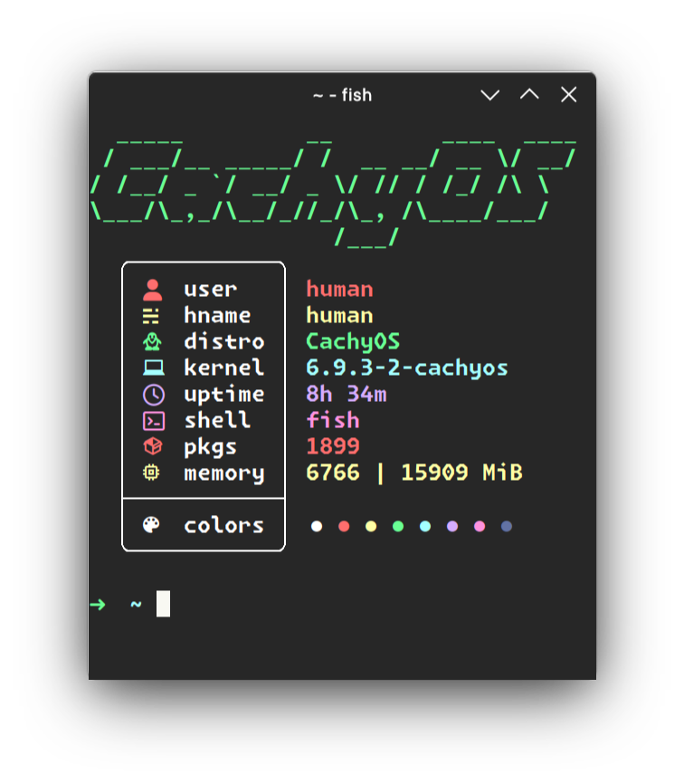

# Nitch

Incredibly fast system fetch written in nim

## Description



`nitch` is a small and incredibly fast system fetch written fully in `nim👑` without any dependencies. Why `nim👑`? Because it's fast and simple.

## Installation ☁️

```sh
wget https://raw.githubusercontent.com/gabrielcapilla/nitch/main/setup && sh setup
```

## Usage 🪨

```sh
nitch
```

flags:

```sh
 -f --fetch   | return fetch about system
 -h --help    | return help message
 -v --version | return version of program
```

## Building 📦

### 0) Install [nim](https://nim-lang.org/)

### 1) Clone the repository

```sh
git clone https://github.com/unxsh/nitch.git
```

### 2) Change dir to `nitch`

```sh
cd nitch
```

### 3) Build program with `nimble`

```sh
nimble build
```

After that you will get a ready-made binary file in the root directory of the project.

## Special thanks to

- [sleet](https://github.com/ssleert/nitch)

## Thanks for ideas & examples 💬

- [pfetch](https://github.com/dylanaraps/pfetch/)
- [neofetch](https://github.com/dylanaraps/neofetch)
- [paleofetch](https://github.com/ss7m/paleofetch)
- [rxfetch](https://github.com/Mangeshrex/rxfetch)
- [nerdfetch](https://github.com/ThatOneCalculator/NerdFetch)
