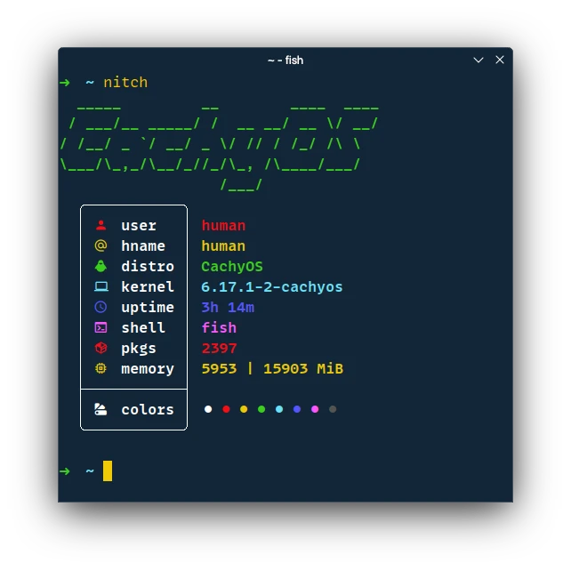

# Nitch

A lightning-fast system fetch utility written in [Nim](https://github.com/nim-lang/Nim) that displays your system information alongside a customizable logo in the terminal. Similar to neofetch alternative but optimized for performance  without any dependencies.

<div align="center">
  
  <br>
</div>

## Features

- **Customizable**: Easy to modify and extend
- **Cross-platform**: Works on most Unix-like systems
- **Lightning fast**: Compiled with maximum optimizations
- **Low memory footprint**: Minimal resource usage
- **No external dependencies**: Standalone binary

## Installation

### Using nimble (recommended)

This will automatically compile and install the binary.

```sh
nimble install https://github.com/gabrielcapilla/nitch.git
```

### Manual installation

```sh
git clone https://github.com/gabrielcapilla/nitch.git
cd nitch
nimble install
```

## Usage

```sh
nitch
```

### Flags

```sh
 -f --fetch   | return fetch about system
 -n --nologo  | return fetch without logo
 -h --help    | return help message
 -v --version | return version of program
```

## Build

### Prerequisites

- [Nim](https://nim-lang.org/) (version 2.2.4 or higher)

### Build commands

| Command            | Description                                           |
|:-------------------|:------------------------------------------------------|
| `nimble build`     | Build with standard optimizations                     |
| `nimble opt`       | Build with speed optimizations                        |
| `nimble ult`       | Build with hard speed optimizations (recommended)     |
| `nimble benchmark` | Run performance benchmark and keep the fastest binary |

## Performance Benchmark

Nitch includes an automated benchmark tool that measures execution speed of different compilation variants and automatically keeps the fastest one:

```sh
nimble benchmark
```

This will:
1. Compile all 4 variants (normal, release, opt, ult)
2. Run performance tests on each
3. Identify the fastest variant
4. Automatically remove slower variants
5. Keep only the fastest binary

### Benchmark results preview

```sh
Running benchmarks (50 iterations each)...

Version      | Total Time  | Average     | Min         | Max
-------------|-------------|-------------|-------------|-----------
normal       |   0.001620s |     32.39μs |     24.18μs |     69.15μs
release      |   0.001521s |     30.42μs |     25.00μs |     41.33μs
opt          |   0.001507s |     30.15μs |     23.74μs |     43.27μs
ult          |   0.001392s |     27.83μs |     24.66μs |     39.82μs

Fastest version: ult (average: 27.83μs)
Slowest version: normal (average: 32.39μs)
Improvement from normal to ult: 116.39% faster

Binary sizes:
normal     :  445216 bytes
release    :  259320 bytes
opt        :  202336 bytes
ult        :  164096 bytes

System optimization...
Removing slower versions...
  - Removed: nitch_normal
  - Removed: nitch_release
  - Removed: nitch_opt
  - Kept: nitch (from nitch_ult)
```

# Acknowledgments

- [Nim](https://github.com/nim-lang/Nim) for the amazing programming language
- [sleert](https://github.com/ssleert/nitch) without you this fork would not exist
