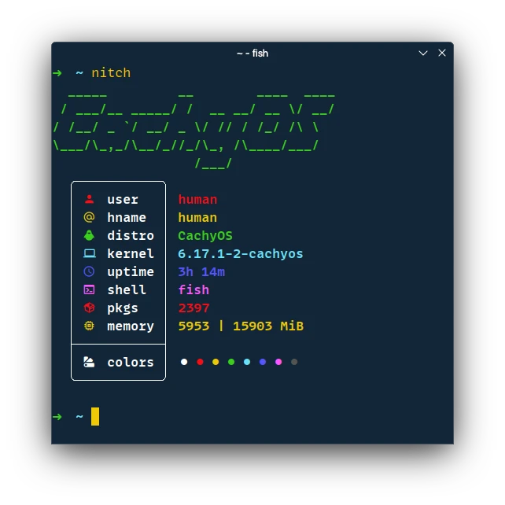

# Nitch

A lightning-fast system fetch utility written in [Nim](https://github.com/nim-lang/Nim) that displays your system information alongside a customizable logo in the terminal. Optimized for performance without any dependencies.

<div align="center">
  
  <br>
</div>

## Features

- **Customizable**: Easy to modify and extend
- **Cross-platform**: Works on most Unix-like systems
- **Lightning fast**: Compiled with maximum optimizations
- **Low memory footprint**: Minimal resource usage
- **No external dependencies**: Standalone binary

## Installation

### Prerequisites

- [Nim](https://nim-lang.org/) (version 2.2.6 or higher)

### Using Nimble

This will automatically compile and install the binary.

```sh
nimble install https://github.com/gabrielcapilla/nitch.git
```

### Manual installation

```sh
git clone https://github.com/gabrielcapilla/nitch.git
cd nitch
```

Build with hard speed optimizations.

```sh
nimble release
```

Install the binary in your local installation directory

```sh
mv nitch $HOME/.local/bin
```

## Usage

```sh
nitch
```

### Flags

```sh
 -f --fetch   | return fetch about system
 -n --nologo  | return fetch without logo
 -h --help    | return help message
 -v --version | return version of program
```

## Build commands

| Command            | Description                                           |
| :----------------- | :---------------------------------------------------- |
| `nimble release    | Build with hard speed optimizations (recommended)     |
| `nimble benchmark` | Run performance benchmark and keep the fastest binary |

## Performance Benchmark

Nitch includes an automated benchmark tool that measures execution speed of different compilation variants and automatically keeps the fastest one:

```sh
nimble benchmark
```

This will:

1. Compile all 3 variants (debug, standard, optimized)
2. Run performance tests on each
3. Identify the fastest variant
4. Automatically remove slower variants
5. Keep only the fastest binary

### Benchmark results preview

```sh
Running benchmark

Variant               | Total Time  | Average     | Min         | Max
----------------------|-------------|-------------|-------------|-----------
Debug                 |   0.392411s |   7848.22μs |   7642.60μs |   8293.32μs
Standard (-d:release) |   0.101966s |   2039.31μs |   1942.88μs |   2226.64μs
Optimized (Custom)    |   0.095052s |   1901.04μs |   1842.65μs |   2010.93μs

Fastest variant: optimized (avg: 1901.04μs)
Slowest variant: debug (avg: 7848.22μs)
Improvement: 412.84% faster

Binary sizes:
debug     :  373712 bytes
standard  :  207728 bytes
optimized :  105032 bytes

System optimization...
Cleaning up...
  - Removed: nitch_debug
  - Removed: nitch_standard
  - Kept: nitch (renamed from nitch_optimized)

Done! The 'nitch' binary is now the fastest version.
```

## Repository & Support

- **GitHub:** [gabrielcapilla/parun](https://github.com/gabrielcapilla/parun)
- **Nostr:** [@gabrielcapilla](https://nostree.me/npub1uf2dtc8wfpd7g4papst44uy0yzlnud54tzglhffrr3yvh6hnjefq4uy52e)
